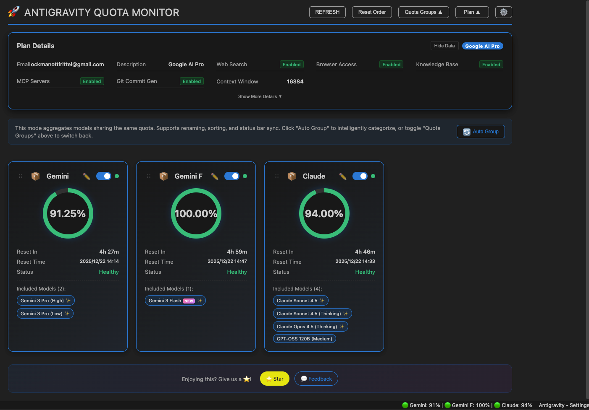
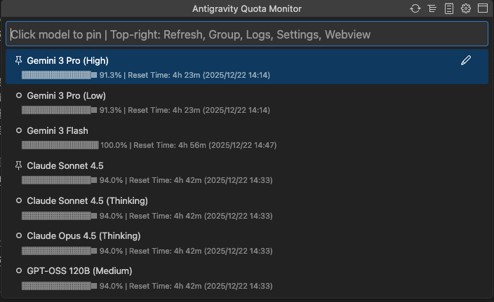
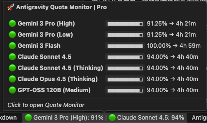
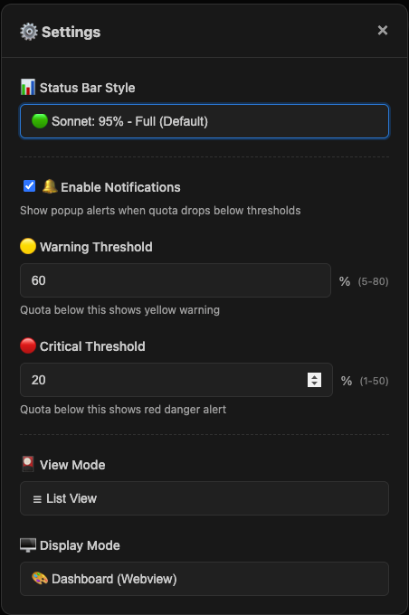

# Antigravity Cockpit

[English](README.en.md) · 简体中文

[](https://open-vsx.org/extension/jlcodes/antigravity-cockpit)
[](https://open-vsx.org/extension/jlcodes/antigravity-cockpit)
[](https://github.com/jlcodes99/vscode-antigravity-cockpit)
[](https://github.com/jlcodes99/vscode-antigravity-cockpit/issues)
[](https://github.com/jlcodes99/vscode-antigravity-cockpit)

VS Code 扩展，用于监控 Google Antigravity AI 模型配额。

**功能**：Webview 仪表盘 · QuickPick 模式 · 配额分组 · 自动分组 · 重命名 · 卡片视图 · 拖拽排序 · 状态栏监控 · 阈值通知 · 隐私模式

**语言**：跟随 VS Code 语言设置，支持 16 种语言

🇺🇸 English · 🇨🇳 简体中文 · 繁體中文 · 🇯🇵 日本語 · 🇩🇪 Deutsch · 🇪🇸 Español · 🇫🇷 Français · 🇮🇹 Italiano · 🇰🇷 한국어 · 🇧🇷 Português · 🇷🇺 Русский · 🇹🇷 Türkçe · 🇵🇱 Polski · 🇨🇿 Čeština · 🇸🇦 العربية · 🇻🇳 Tiếng Việt

---

## 功能概览

### 显示模式

提供两种显示模式，可在设置中切换 (`agCockpit.displayMode`)：

#### Webview 仪表盘



- **卡片视图**：卡片布局展示模型配额
- **分组模式**：按配额池聚合模型，显示分组配额
- **非分组模式**：显示单个模型配额
- **拖拽排序**：拖动卡片调整显示顺序
- **自动分组**：根据配额池自动归类模型

#### QuickPick 模式



使用 VS Code 原生 QuickPick API，适用于：
- Webview 无法加载的环境
- 偏好键盘操作的用户
- 需要快速查看配额

功能：
- 支持分组 / 非分组模式
- 标题栏按钮：刷新、切换分组、打开日志、设置、切换到 Webview
- 置顶模型到状态栏
- 重命名模型和分组

---

### 状态栏

显示当前监控模型的配额状态。支持 6 种格式：

| 格式 | 示例 |
|------|------|
| 仅图标 | `🚀` |
| 仅状态点 | `🟢` / `🟡` / `🔴` |
| 仅百分比 | `95%` |
| 状态点 + 百分比 | `🟢 95%` |
| 名称 + 百分比 | `Sonnet: 95%` |
| 完整显示 | `🟢 Sonnet: 95%` |

- **多模型置顶**：可同时监控多个模型
- **自动监控**：未指定模型时，自动显示剩余配额最低的模型

---

### 配额显示

每个模型 / 分组显示：
- **剩余配额百分比**
- **倒计时**：如 `4h 40m`
- **重置时间**：如 `15:16`
- **进度条**：可视化剩余配额

---

### 配额来源（本地 / 授权）

支持两种配额来源，可在面板右上角随时切换：

- **本地监控**：读取本地 Antigravity 客户端进程，更稳定但需要客户端运行
- **授权监控**：通过授权访问远端接口获取配额，不依赖本地进程，适合 API 中转或无客户端场景
- **多账号授权**：授权监控支持多个账号，支持切换当前账号与状态展示
- **切换提示**：切换过程中会显示加载/超时提示，网络异常时可切回本地

---

### 模型能力提示



悬停模型名称查看：
- 支持的输入类型（文本、图片、视频等）
- 上下文窗口大小
- 其他能力标记

---

### 分组功能

- **按配额池分组**：共享配额池的模型自动或手动归类
- **自定义分组名称**：点击编辑图标重命名
- **分组排序**：拖拽调整分组顺序
- **分组置顶**：将分组固定到状态栏

---

### 设置面板



通过仪表盘右上角齿轮图标打开，可配置：
- 状态栏显示格式
- 警告阈值（黄色）
- 危险阈值（红色）
- 视图模式（卡片 / 列表）
- 通知开关

---

### 用户资料面板

显示：
- 订阅等级
- 用户 ID
- 可折叠，隐私数据可脱敏

---

### 通知

当模型配额低于警告阈值或耗尽时发送通知。可在设置中禁用。

---

## 使用

1. **打开**：
   - 点击状态栏图标
   - 或 `Ctrl/Cmd+Shift+Q`
   - 或命令面板运行 `Antigravity Cockpit: Open Dashboard`

2. **刷新**：点击刷新按钮或 `Ctrl/Cmd+Shift+R`（仪表盘激活时）

3. **故障排查**：
   - "Systems Offline" 时点击 **Retry Connection**
   - 点击 **Open Logs** 查看调试日志（授权请求会显示完整 URL 以便区分域名）

---

---

### 自动唤醒 (Auto Wake-up)

**NEW** 🔥 设置定时任务，提前唤醒 AI 模型，触发配额重置周期。

- **灵活调度**：支持每天、每周、间隔循环和高级 Crontab 模式
- **多模型支持**：同时唤醒多个模型
- **多账号授权**：支持多个账号授权、切换当前账号、查看账号状态
- **账号管理**：新增授权管理弹窗，可重新授权或移除账号
- **安全保障**：凭证加密存储于 VS Code Secret Storage，本地运行
- **历史记录**：查看详细的触发日志和 AI 响应
- **使用场景**：上班前自动唤醒，利用闲置时间跑完重置 CD

---

## 配置项

| 配置 | 默认值 | 说明 |
|------|--------|------|
| `agCockpit.displayMode` | `webview` | 显示模式：`webview` / `quickpick` |
| `agCockpit.refreshInterval` | `120` | 刷新间隔（秒，10-3600） |
| `agCockpit.statusBarFormat` | `standard` | 状态栏格式 |
| `agCockpit.groupingEnabled` | `true` | 启用分组模式 |
| `agCockpit.warningThreshold` | `30` | 警告阈值（%） |
| `agCockpit.criticalThreshold` | `10` | 危险阈值（%） |
| `agCockpit.notificationEnabled` | `true` | 启用通知 |
| `agCockpit.pinnedModels` | `[]` | 状态栏置顶模型 |
| `agCockpit.pinnedGroups` | `[]` | 状态栏置顶分组 |

---

## 安装

### Open VSX 市场
1. `Cmd/Ctrl+Shift+X` 打开扩展面板
2. 搜索 `Antigravity Cockpit`
3. 点击安装

### VSIX 文件
```bash
code --install-extension antigravity-cockpit-x.y.z.vsix
```

---

## 从源码构建

```bash
# 克隆仓库
git clone https://github.com/jlcodes99/vscode-antigravity-cockpit.git
cd vscode-antigravity-cockpit

# 安装依赖
npm install

# 编译
npm run compile

# 打包
npm run package
```

要求：Node.js v18+, npm v9+

---

## 更新日志

- [CHANGELOG.md](CHANGELOG.md)（英文）
- [CHANGELOG.zh-CN.md](CHANGELOG.zh-CN.md)（中文）

---

## 致谢

- 本项目最初的进程检测逻辑参考了 [Antigravity Quota](https://github.com/Henrik-3/AntigravityQuota)。
- [Antigravity Quota](https://github.com/Henrik-3/AntigravityQuota) 的进程检测逻辑源自 [AntigravityQuotaWatcher](https://github.com/wusimpl/AntigravityQuotaWatcher)。

感谢以上项目作者的开源贡献！如果这些项目对你有帮助，也请给他们点个 ⭐ Star 支持一下！

---

## 支持

- ⭐ [GitHub Star](https://github.com/jlcodes99/vscode-antigravity-cockpit)
- 💬 [反馈问题](https://github.com/jlcodes99/vscode-antigravity-cockpit/issues)

---

## 💬 交流群

QQ交流群 或者加我微信 拉微信群

| QQ 群 | 微信（个人） |
| :---: | :---: |
|  |  |

---

## ☕ 请作者喝杯咖啡

如果这个插件对你有帮助，欢迎请作者喝杯咖啡！你的支持是我持续更新的最大动力 ❤️

[](docs/DONATE.md)

---

## Star History

[](https://star-history.com/#jlcodes99/vscode-antigravity-cockpit&Date)

---

## 许可证

[MIT](LICENSE)

---

## 免责声明

本项目仅供个人学习和研究使用。使用本项目即表示您同意：

- 不将本项目用于任何商业用途
- 承担使用本项目的所有风险和责任
- 遵守相关服务条款和法律法规

项目作者对因使用本项目而产生的任何直接或间接损失不承担责任。
